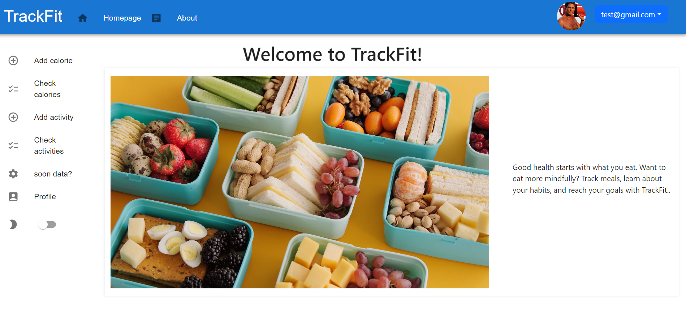
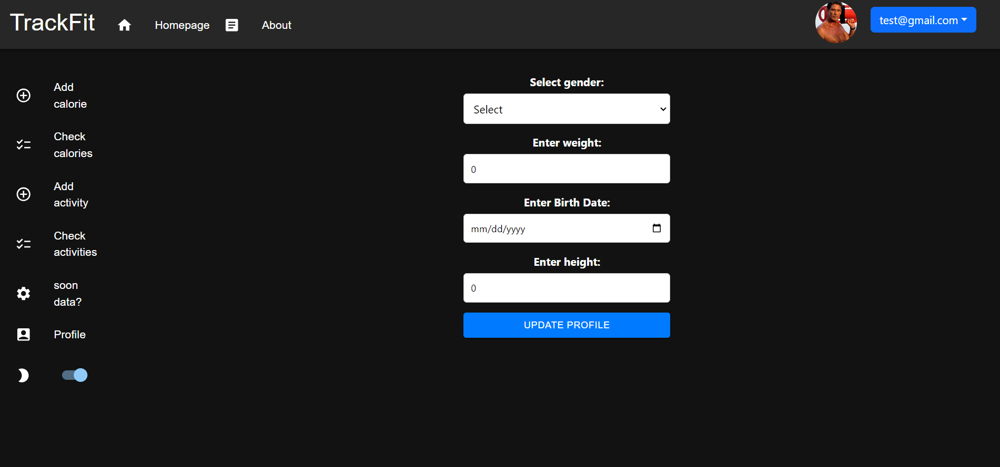

<a name="readme-top"></a>

# Fitness Tracker Application

The Fitness Tracker Application is a web-based platform that allows users to track their daily activities and food consumption. Users can log in, record their activities, and keep track of the calories burned and consumed. This README provides an overview of the application's features, how to set it up, and its usage.

## Table of Contents

- [Features](#features)
- [Prerequisites](#prerequisites)
- [Installation](#installation)
- [Usage](#usage)


## Screenshots





## Features

- User Registration: Users can create accounts by providing their basic information.
- User Authentication: Secure user authentication with JWT tokens.
- Activity Tracking: Users can log various physical activities with associated calories burned.
- Food Consumption Tracking: Users can record meals with the number of calories consumed.
- Analytics: Provides daily calorie consumption and activity analytics for users.
- User Profile: Users can view and update their profile information.


### Built With

* [![React][React.js]][React-url]
* [![JavaScript][JavaScript.img]][JavaScript-url]
* [![Spring][Spring.img]][Spring-url]
* [![SpringBoot][SpringBoot.img]][SpringBoot-url]
* [![Postgres][Postgres.img]][Postgres-url]

### Prerequisites
1. JAVA 17
2. MAVEN
3. POSTGRES SQL
4. IDE - for backend, for example INTELLIJ IDEA
6. Docker

### Installation

1. Clone the repository:

   ```bash
   git clone git@github.com:DekanyDorottya/calorie-tracker.git
   ```

2. Change into the project directory:

   ```bash
   cd calorie-tracker
   ```

1. Pull the image from Dockerhub by using a bash terminal:

   ```sh
   docker pull arondocker100/fitnesstracker


2. In the root directory of the repository you will find a compose file called docker-compose-app.yml. Copy this compose file into a new folder


3. Run the compose file in bash terminal

    ```sh
    docker-compose -f docker-compose-app.yml up


### Usage
1. Register or log in to the application.
2. Update your user profile with additional information.
3. Log your activities by providing activity type, calories burned, and date/time.
4. Log your meals by providing food type, calories consumed, and date/time.
5. View your daily analytics to track calorie consumption and activity.

<p align="right">(<a href="#readme-top">:top:</a>)</p>


[React.js]: https://img.shields.io/badge/React-20232A?style=for-the-badge&logo=react&logoColor=61DAFB
[React-url]: https://reactjs.org/
[JavaScript.img]:     https://img.shields.io/badge/JavaScript-323330?style=for-the-badge&logo=javascript&logoColor=F7DF1E
[JavaScript-url]: https://www.javascript.com/
[Spring.img]: https://img.shields.io/badge/Spring-6DB33F?style=for-the-badge&logo=spring&logoColor=white
[Spring-url]: https://spring.io/
[Postgres.img]: https://img.shields.io/badge/PostgreSQL-316192?style=for-the-badge&logo=postgresql&logoColor=white
[Postgres-url]: https://www.postgresql.org/
[SpringBoot.img]: https://img.shields.io/badge/Spring_Boot-F2F4F9?style=for-the-badge&logo=spring-boot
[SpringBoot-url]: https://spring.io/projects/spring-boot
[Docker.img]: https://img.shields.io/badge/Docker-2CA5E0?style=for-the-badge&logo=docker&logoColor=white
[Docker-url]: https://www.docker.com/